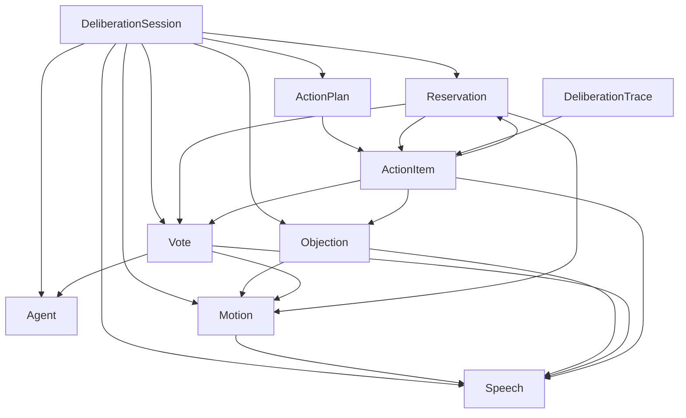

# Deliberation State Model

## One-Line Definition

定义 `Deliberation Session` 的 core domain snapshot：用固定对象、枚举、状态转换和引用规则承载个人决策场景中的多 AI Agent 议事过程。

## Status

进行中

## Priority

高

## Problem

RONR 的核心价值是让多个 AI Agent 的讨论过程可控、可追溯、可收敛。如果没有稳定的状态模型，Web、Agent Runtime、Model Provider 和 Action Plan Trace 会各自解释阶段、表决、反对意见和保留意见，最终导致行动清单无法说明“为什么这样建议”。

## Users

- 个人决策用户
- Chair Agent
- Secretary Agent
- Member Agent
- Web UI
- Orchestrator
- 后续实现者

## Goals

- 固定 P0 最小 Web 闭环的 core domain 对象边界。
- 区分 `Session Status`、`Stage`、`Motion Status` 和对象级 `Resolution Status`。
- 固定 `Vote.position`、角色、mandate、阶段和关键状态枚举。
- 保证 `Action Item` 能追溯到 `Speech`、`Objection`、`Vote`、`Reservation` 和用户插话影响。
- 让 UI、Provider Adapter 和持久化层只能通过契约读写核心状态，不能直接绕过核心校验。

## Non-Goals

- 数据库 schema、migration 或 repository 设计。
- 外部 API request / response 的完整字段。
- Session Event Log 的事件枚举和 replay 实现。
- 长期用户记忆、跨会话画像或组织协作。
- 完整 Robert's Rules of Order 的全部程序对象。

## User Flow

1. 用户通过 Web 输入个人决策问题，并选择输出语言环境。
2. RONR 创建 `Deliberation Session`，初始 `status` 为 `created`。
3. Chair Agent 确认目标和约束后，系统进入 `active` 状态并推进 `Stage`。
4. Member Agent 在对应阶段产出 `Speech`、`Objection`、`Vote` 或 `Reservation`。
5. Chair Agent 根据状态校验决定是否进入下一阶段、重开阶段或暂停。
6. Secretary Agent 生成 `Action Plan`，每个 `Action Item` 保留来源引用。
7. Web UI 根据 snapshot 展示阶段、Agent 发言、分歧、表决和行动清单。

## Requirements

### State Ownership

- `DeliberationSession` 是 core domain 的聚合根，所有议事对象必须归属于一个 session。
- Orchestrator 只能通过核心命令更新 session，例如确认目标、记录发言、记录反对意见、记录表决、生成行动清单。
- Web UI 不直接推断议事规则，只展示 validated snapshot。
- Model Provider 输出必须先经过 schema 和状态校验，校验通过后才能写入 session。
- `Deliberation Trace` 是由来源 ID 组成的可追溯结构，不是自然语言总结的替代品。

### Session Status

`Session Status` 表达会话生命周期，不表达当前议事阶段。

| Value | Meaning |
| --- | --- |
| `created` | 会话已创建，但尚未完成议题确认。 |
| `active` | 会话可以自动继续推进。 |
| `paused` | 用户暂停、等待用户补充，或运行时需要恢复处理。 |
| `completed` | `Action Plan` 已生成并通过最小质量检查。 |
| `cancelled` | 用户主动放弃本次议事。 |
| `failed` | 会话进入不可自动恢复的失败状态。 |

允许的生命周期转换：

```text
created -> active
active -> paused
paused -> active
active -> completed
active -> cancelled
paused -> cancelled
active -> failed
paused -> failed
```

`completed`、`cancelled` 和 `failed` 是终态。终态 session 不再继续写入新的议事输出，除非后续通过新 session 或明确的复制重开能力处理。`cancelled` 表示用户主动放弃，不代表系统错误；`failed` 才表示系统或运行时不可恢复失败。

### Stage

`Stage` 表达当前议事流程位置。实现字段名沿用现有 architecture 和 contracts 中的 `phase`，但 glossary 中的 canonical term 使用 `Stage` 描述该概念。

P0 固定阶段值：

| Value | Stage | Required Output |
| --- | --- | --- |
| `call_to_order` | Call to Order | `goal`、初始 `constraints`、`locale`。 |
| `main_motion` | Main Motion | 至少一个 `Motion`。 |
| `opening_statements` | Opening Statements | Member Agent 的初始 `Speech`。 |
| `objections_and_risks` | Objections and Risks | `Objection`、风险、反例或明确的无新增反对记录。 |
| `amendment` | Amendment | 修正后的 `Motion` 或保留原 motion 的理由。 |
| `deliberation` | Deliberation | 围绕 motion 的聚焦 `Speech`。 |
| `vote_or_consensus` | Vote or Consensus | Member Agent 的 `Vote` 与可选 `Reservation`。 |
| `action_resolution` | Action Resolution | 带来源引用的 `Action Plan`。 |

`User Interruption` 不是固定 `Stage` 值。用户插话可以让 session 进入 `paused`，追加约束，或重开某个既有阶段。

### Core Objects

#### `DeliberationSession`

最小字段：

- `id`
- `userQuestion`
- `goal`
- `constraints`
- `locale`：会话输出语言环境，建议使用 BCP 47 语言标签，例如 `zh-CN`、`en-US`。
- `maxDeliberationRounds`：用户可选设置的最大讨论轮次；为空时由 AI 自动判断收敛。
- `deliberationRoundCount`：当前 Deliberation 阶段已完成的讨论轮次数。
- `convergenceStatus`：Deliberation 阶段的收敛判断状态。
- `status`：`created`、`active`、`paused`、`completed`、`cancelled`、`failed`。
- `phase`：当前 `Stage` 值。
- `agents`
- `motions`
- `speeches`
- `objections`
- `votes`
- `reservations`
- `trace`
- `actionPlan`
- `createdAt`
- `updatedAt`

设计规则：

- `locale` 不改变协议字段、枚举和 canonical term，只影响用户可见文案与最终输出语言。
- `maxDeliberationRounds` 为空不代表允许无限讨论；系统必须在每轮后执行 `Convergence Check`。
- `deliberationRoundCount` 只统计 Deliberation 阶段的聚焦讨论轮次，不统计 Call to Order、Opening Statements 或 Vote。
- `status` 与 `phase` 必须同时存在，不能用 `completed` 代替 `phase`，也不能用 `action_resolution` 代替 `status`。
- `constraints` 必须保留用户原始约束和插话新增约束的来源。

#### `ConvergenceStatus`

`ConvergenceStatus` 表示 Deliberation 阶段是否可以进入 `vote_or_consensus`。

固定值：

| Value | Meaning |
| --- | --- |
| `not_checked` | 尚未进行收敛判断。 |
| `converged` | AI 判断讨论已收敛，可以进入表决或共识确认。 |
| `not_converged` | AI 判断仍需继续讨论。 |
| `round_limit_reached` | 已达到用户设置的最大讨论轮次。 |

设计规则：

- 用户设置 `Max Deliberation Rounds` 时，达到上限后必须停止继续追加 Deliberation 轮次，并进入 `vote_or_consensus` 或请求用户确认重开/继续。
- `round_limit_reached` 不等同于 `converged`，最终 Action Plan 或 trace 必须保留该收敛原因。
- 用户未设置 `Max Deliberation Rounds` 时，每轮 Deliberation 后由 Chair Agent 执行 `Convergence Check`。
- `Convergence Check` 至少判断是否仍有未处理的 blocking Objection、是否出现新增实质信息、是否已有可表决 Motion。

#### `Agent`

最小字段：

- `id`
- `model`
- `role`
- `mandate`
- `constraints`
- `outputSchema`

设计规则：

- `role` 固定为 `chair`、`secretary`、`member`。
- `mandate` 对 Member Agent 生效，固定为 `general`、`user-advocate`、`domain-expert`、`action-planner`、`red-team`。
- 每个 session 必须有一个 Chair Agent、一个 Secretary Agent、至少两个 Member Agent。
- Chair Agent 和 Secretary Agent 默认不生成普通辩论 `Speech` 和 `Vote`，除非未来 feature 明确扩展。
- 同一模型可以实例化为多个 Agent，但每个 Agent 必须有独立 `id`、`role` 和 `mandate`。

#### `Motion`

`Motion` 表示可讨论、修正和表决的候选主张。

最小字段：

- `id`
- `sessionId`
- `title`
- `description`
- `status`
- `createdFrom`
- `parentMotionId`
- `amendmentIds`
- `supportingSpeechIds`
- `opposingSpeechIds`
- `riskIds`
- `voteIds`

`Motion Status` 固定为：

| Value | Meaning |
| --- | --- |
| `proposed` | 已提出，尚未完成讨论。 |
| `under_deliberation` | 正在被讨论。 |
| `amended` | 已被修正，仍可继续讨论或表决。 |
| `ready_for_vote` | 已满足进入表决的最低条件。 |
| `adopted` | 已通过表决或共识确认。 |
| `rejected` | 未被采纳，不进入推荐方向。 |

设计规则：

- P0 可以只有一个主 motion 和少量修正 motion。
- `parentMotionId` 用于记录修正关系；主 motion 的 `parentMotionId` 为空。
- `createdFrom` 必须引用用户问题、Chair Agent 输出或 Speech 来源，不能只存自然语言描述。
- 被 `rejected` 的 motion 可以继续作为证据链中的对比项，但不能成为主行动方向。

#### `Speech`

`Speech` 是 Agent 在某个阶段的结构化表达，也是证据链的基础单元。

最小字段：

- `id`
- `sessionId`
- `agentId`
- `role`
- `phase`
- `content`
- `claims`
- `assumptions`
- `references`
- `createdAt`

设计规则：

- `phase` 必须记录 Speech 生成时的阶段值。
- `claims`、`assumptions` 和 `references` 必须结构化，便于后续提取风险、分歧和行动来源。
- `references` 使用 `Source Reference` 表达来源，可以指向用户问题、附件、前序 Speech、Objection、Vote、`Search Result Summary` 或外部资料摘要。
- Agent 在表达观点前的联网搜索结果必须以摘要和来源引用形式进入 `references`，不能保存完整网页抓取内容。
- 模型 thinking / reasoning 的原始推理链不得进入 `Speech.content`、`claims`、`assumptions` 或 `references`。
- 同一 Agent 在同一阶段可以有多条 Speech，但必须保留顺序。

#### `Objection`

`Objection` 表示风险、漏洞、反例、约束冲突、执行代价或替代观点。

最小字段：

- `id`
- `sessionId`
- `motionId`
- `raisedBy`
- `type`
- `description`
- `severity`
- `condition`
- `sourceSpeechId`
- `resolutionStatus`

`Objection Type` 固定为：

| Value | Meaning |
| --- | --- |
| `risk` | 潜在失败或负面结果。 |
| `counterexample` | 反例或不适用场景。 |
| `cost` | 时间、资金、机会成本或复杂度。 |
| `constraint_conflict` | 与用户约束冲突。 |
| `alternative` | 替代方向或更优路径。 |

`Objection Severity` 固定为：

| Value | Meaning |
| --- | --- |
| `low` | 需要记录，但不影响主要结论。 |
| `medium` | 需要在行动项中体现条件或验证步骤。 |
| `high` | 可能改变推荐方向或优先级。 |
| `blocking` | 未处理前不应进入推荐方向。 |

`Resolution Status` 固定为：

| Value | Meaning |
| --- | --- |
| `open` | 尚未处理。 |
| `addressed` | 已通过修正、解释或行动项处理。 |
| `accepted_risk` | 风险被接受，并在 Action Plan 中保留。 |
| `converted_to_condition` | 已转成行动条件或验证步骤。 |
| `rejected` | 经讨论后不采纳该反对意见。 |

设计规则：

- `blocking` 且 `open` 的 Objection 不允许被相关 Action Item 忽略。
- `converted_to_condition` 必须能追溯到对应 Action Item 的 `conditions` 或 `firstValidation`。
- 如果 Agent 只是附加非阻断性顾虑，应使用 `Reservation`，不要伪装成 blocking Objection。

#### `Vote`

`Vote` 表示 Agent 对 motion 的立场记录。

最小字段：

- `id`
- `sessionId`
- `motionId`
- `agentId`
- `position`
- `reason`
- `conditions`
- `sourceSpeechId`
- `reservationIds`

`Vote.position` 固定为：

| Value | Meaning |
| --- | --- |
| `support` | 支持该 motion。 |
| `oppose` | 反对该 motion。 |
| `abstain` | 弃权，不计为支持或反对。 |
| `qualified_support` | 有条件支持，必须给出条件。 |

设计规则：

- `Reservation` 不是 `Vote.position`。
- `qualified_support` 必须包含 `conditions`。
- `abstain` 不得被统计为 `support`，也不得自动转成 `Reservation`。
- 每个参与表决的 Member Agent 对同一个 motion 最多有一条有效 Vote；如重开阶段后重新表决，应保留旧 Vote 并通过事件或版本区分。
- `reason` 必须引用前序 Speech、Objection 或 Motion 内容，不能只写空泛结论。

#### `Reservation`

`Reservation` 是附加在 Vote、Motion 或 Action Item 上的非阻断性保留意见。

最小字段：

- `id`
- `sessionId`
- `agentId`
- `targetType`
- `targetId`
- `content`
- `condition`
- `sourceSpeechId`
- `createdAt`

设计规则：

- `targetType` 首版支持 `vote`、`motion`、`action_item`。
- Reservation 不改变 Vote.position，也不阻止 Action Plan 生成。
- 如果顾虑会阻止推荐方向，应记录为 `Objection`，而不是 `Reservation`。
- Action Plan 必须能展示与行动项相关的 Reservation。

#### `ActionPlan` and `ActionItem`

`ActionPlan` 是最终主输出。

`ActionPlan` 最小字段：

- `summary`
- `recommendedDirection`
- `consensus`
- `disagreements`
- `largestRisks`
- `notRecommended`
- `nextSmallestAction`
- `items`

每个 `ActionItem` 最小字段：

- `id`
- `content`
- `reason`
- `expectedBenefit`
- `risks`
- `firstValidation`
- `conditions`
- `sourceSpeechIds`
- `sourceObjectionIds`
- `sourceVoteIds`
- `sourceReservationIds`
- `userInterruptionImpact`

设计规则：

- 每个 Action Item 至少引用一个 `Speech` 和一个 `Vote`。
- 如果 Action Item 包含风险，必须引用相关 `Objection` 或说明风险来自哪个 `Speech`。
- 如果相关 Vote 存在 `qualified_support`，Action Item 必须体现对应条件。
- 如果存在相关 Reservation，Action Item 必须通过 `sourceReservationIds` 保留。
- `userInterruptionImpact` 记录用户插话是否新增约束、改变优先级、重开阶段或影响该行动项。

#### `DeliberationTrace`

`DeliberationTrace` 是从最终输出回到过程记录的结构化索引。

设计规则：

- Trace 只引用已经存在的对象 ID，不重复保存对象正文。
- Trace 必须能回答：这个行动项来自哪些 Speech，处理了哪些 Objection，获得了哪些 Vote，保留了哪些 Reservation，是否受用户插话影响。
- Trace 可以被 UI 展开为 `Evidence Chain`，也可以被 Quality Review 用于检查覆盖率。

### Object Relationship Design

核心关系：

- `DeliberationSession` owns `Agent`、`Motion`、`Speech`、`Objection`、`Vote`、`Reservation`、`ActionPlan`。
- `Motion` references supporting and opposing `Speech`。
- `Objection` references one `Motion` and one `sourceSpeechId`。
- `Vote` references one `Motion`、one `Agent` and one `sourceSpeechId`。
- `Reservation` references one target object through `targetType` and `targetId`。
- `ActionItem` references `Speech`、`Objection`、`Vote` and `Reservation` through source ID lists。
- `DeliberationTrace` references the same source IDs and exposes them as user-facing `Evidence Chain`。

最小关系图：



### Validation Rules

#### Composition Validation

- 必须存在且只存在一个 Chair Agent。
- 必须存在且只存在一个 Secretary Agent。
- 必须存在至少两个 Member Agent。
- 每个 Agent 的 `role`、`mandate`、`model` 和 `outputSchema` 必须可识别。
- 同一个 session 内所有对象 ID 必须唯一。

#### Stage Validation

- `created` session 只能进入 `call_to_order`。
- `cancelled`、`completed` 和 `failed` session 不允许继续推进阶段。
- 没有 `goal` 和初始 `constraints` 时，不能进入 `main_motion`。
- 没有 `Motion` 时，不能进入 `opening_statements`。
- 没有 Member Agent 的初始 Speech 时，不能进入 `objections_and_risks`。
- 没有 Objection、风险记录或明确的无新增反对记录时，不能进入 `amendment`。
- 没有可表决的 Motion 时，不能进入 `vote_or_consensus`。
- `deliberation` 进入 `vote_or_consensus` 前，必须满足 `convergenceStatus` 为 `converged` 或 `round_limit_reached`。
- 没有有效 Vote 时，不能进入 `action_resolution`。
- 没有可追溯 Action Item 时，不能进入 `completed`。

#### Reference Integrity

- 所有 `sourceSpeechIds`、`sourceObjectionIds`、`sourceVoteIds` 和 `sourceReservationIds` 必须存在于同一 session。
- `Speech.agentId` 必须引用同一 session 的 Agent。
- `Speech.references` 中的搜索来源必须包含可展示标题、来源 URL 或 provider source id、摘要和检索时间。
- `Objection.motionId`、`Vote.motionId` 必须引用同一 session 的 Motion。
- `Reservation.targetId` 必须存在，并且类型必须匹配 `targetType`。
- Action Item 不能引用被删除或跨 session 的对象。

#### Vote and Reservation Validation

- `Vote.position` 只允许 `support`、`oppose`、`abstain`、`qualified_support`。
- 输入 `Reservation` 作为 Vote.position 时必须校验失败。
- `qualified_support` 没有 `conditions` 时必须校验失败。
- `abstain` 必须保留为独立 position，不参与支持票或反对票计算。
- Reservation 必须附着到有效目标，不得作为 blocking Objection 使用。

#### Multilingual Validation

- `locale` 缺失时使用产品默认语言，但不能改变 canonical enum value。
- 所有协议字段、枚举和 ID 使用英文 canonical value。
- 用户可见标题、摘要、Action Item 和风险说明应按 session `locale` 输出。
- 新增状态、阶段、字段或输出术语时，必须同步更新 `docs/glossary.md`。

#### Search and Thinking Validation

- 需要表达观点的 Agent 输出必须关联 `Search Result Summary` 或明确的 search error。
- 搜索失败时不得伪造 `Source Reference`。
- 原始 chain-of-thought 不得写入 session snapshot、event log、trace 或 Action Plan。
- thinking / reasoning 只能以可展示理由、假设、风险和来源引用的形式进入结构化输出。

#### Cancellation Validation

- 用户可以在 `created`、`active` 或 `paused` 状态主动取消 session。
- 取消后 `status` 必须设为 `cancelled`，并保留取消前已有的 `Speech`、`Objection`、`Vote`、`Reservation` 和 trace。
- `cancelled` session 不要求生成 `Action Plan`，也不得伪装成 `completed`。
- 用户主动取消不得记录为 `failed`，除非同时存在系统不可恢复错误。

#### Deliberation Round Validation

- `maxDeliberationRounds` 为空时，必须使用 `Convergence Check` 判断是否继续讨论。
- `maxDeliberationRounds` 有值时，必须为正整数。
- `deliberationRoundCount` 不得超过 `maxDeliberationRounds`。
- 达到 `maxDeliberationRounds` 时，`convergenceStatus` 必须设为 `round_limit_reached`，除非此前已经是 `converged`。
- `round_limit_reached` 的 session 仍可进入表决，但最终输出必须标记该讨论是由轮次上限触发收敛。

### Derived Views

以下内容可以从核心对象派生，不应作为唯一事实来源：

- 表决统计。
- 共识与少数意见摘要。
- 风险清单。
- 行动项证据链展示。
- 每个 Agent 的贡献摘要。
- 用户插话影响摘要。

## Multilingual and Glossary Impact

- 本 feature 复用 `docs/glossary.md` 中已有的 `Deliberation Session`、`Agent`、`Motion`、`Speech`、`Objection`、`Vote`、`Reservation`、`Action Plan`、`Action Item`、`Evidence Chain`、`Stage`、`State Machine`。
- 本 feature 新增或细化 `Session Status`、`Session Snapshot`、`Session Locale`、`Motion Status`、`Objection Type`、`Objection Severity`、`Resolution Status`、`Source Reference`、`User Interruption Impact`、`Max Deliberation Rounds`、`Deliberation Round Count`、`Convergence Check`、`Convergence Status`、`Search Result Summary`、`Thinking Mode`。
- 本 feature 将 `SessionStatus.cancelled` 固定为用户主动放弃本次议事的终态。
- 协议字段和枚举保持英文 canonical value，不随 UI 语言翻译。
- `locale` 只影响用户可见输出，不影响对象关系和校验规则。

## Development Mode

`TDD-first`

该 feature 是所有 P0 核心 feature 的状态基础，应先用单元测试锁定对象关系、枚举、引用完整性和失败校验，再实现状态机和 contracts。

## Acceptance Criteria

- 给定有效的最小 session，状态模型能从 `created` 推进到 `completed`，并生成可追溯 Action Plan。
- 给定未知 `Vote.position`，状态模型校验失败。
- 给定把 `Reservation` 当作 `Vote.position` 的输入，状态模型校验失败。
- 给定 `qualified_support` 但缺少 `conditions`，状态模型校验失败。
- 给定 Action Item 缺少 `sourceSpeechIds` 或 `sourceVoteIds`，状态模型校验失败。
- 给定 Action Item 涉及 Reservation，必须能通过 `sourceReservationIds` 追溯。
- 给定跨 session source ID，状态模型校验失败。
- 给定 `locale`，最终用户可见输出应使用对应语言，但状态枚举保持英文 canonical value。
- 给定用户主动放弃议事，会话进入 `cancelled`，保留已有记录，且不要求生成 Action Plan。
- 给定用户设置最大讨论轮次，达到上限后状态模型不得继续追加 Deliberation 轮次。
- 给定用户未设置最大讨论轮次，系统必须通过 `Convergence Check` 判断是否进入表决。
- 给定 Agent 输出外部事实判断但缺少搜索来源或搜索失败记录，状态模型校验失败。
- 给定 Agent 输出包含原始 chain-of-thought，状态模型校验失败。

## Verification Plan

- 自动化测试：覆盖 session status 转换、stage 前置条件、角色数量、Vote.position 枚举、Reservation 分离、引用完整性、Action Item trace、搜索来源引用、thinking 原始推理泄漏、最大讨论轮次、AI 自动收敛判断。
- fixture 验证：提供一个最小完整 Deliberation Session fixture，一个缺少证据链 fixture，一个包含用户插话和 Reservation 的 fixture。
- 人工检查：核对字段命名与 PRD、Architecture、Glossary 一致，确认产品定位仍为个人决策场景下的多 AI Agent 议事系统。
- 不需要测试的理由：不适用，该 feature 是 core domain 基础。

## Technical Notes

- 该 feature 定义 core domain snapshot，不定义数据库表。
- Session Event Log 负责 append-only 过程记录；本 feature 负责当前 validated snapshot 和对象关系。
- API Contracts and Events 负责 request / response 与 event schema；本 feature 只定义核心对象和校验规则。
- Action Plan Trace 负责最终展示和证据链展开；本 feature 提供可被追溯的 source ID。
- 首版实现可以使用内存对象和 fixture；接入持久化时不得改变上述 canonical enum 和对象关系。

## Rollout

1. 先在 `packages/core` 固定类型、枚举和校验规则。
2. 用 fixture 跑通一场最小个人决策议事。
3. 再让 `RONR Protocol Flow`、`Agent Role Runtime`、`API Contracts and Events` 依赖该状态模型。
4. 最后接入 Web 展示和 Action Plan Trace。
