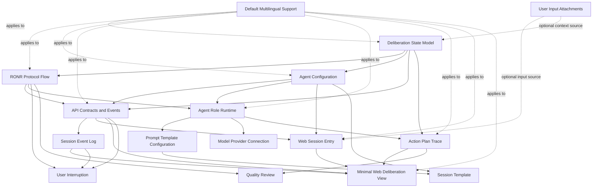

# Feature Index

使用本索引跟踪重要 RONR 功能及其状态。所有 feature 都应围绕“面向个人决策的多 AI Agent 议事系统”，不要偏离为线下会议工具。

## Minimal Web Runtime Slice

| Feature | Status | Priority | Phase | Document |
| --- | --- | --- | --- | --- |
| Default Multilingual Support | 草稿 | 高 | P0 | [default-multilingual-support.md](default-multilingual-support.md) |
| Web Session Entry | 草稿 | 高 | P0 | [web-session-entry.md](web-session-entry.md) |
| User Input Attachments | 草稿 | 中 | P0 | [user-input-attachments.md](user-input-attachments.md) |
| Agent Configuration | 草稿 | 高 | P0 | [agent-configuration.md](agent-configuration.md) |
| Deliberation Session Lifecycle | 草稿 | 中 | P0 | [deliberation-session-lifecycle.md](deliberation-session-lifecycle.md) |
| RONR Protocol Flow | 草稿 | 高 | P0 | [ronr-protocol-flow.md](ronr-protocol-flow.md) |
| Deliberation State Model | 草稿 | 高 | P0 | [deliberation-state-model.md](deliberation-state-model.md) |
| API Contracts and Events | 草稿 | 高 | P0 | [api-contracts-and-events.md](api-contracts-and-events.md) |
| Session Event Log | 草稿 | 高 | P0 | [session-event-log.md](session-event-log.md) |
| Agent Role Runtime | 草稿 | 高 | P0 | [agent-role-runtime.md](agent-role-runtime.md) |
| Prompt Template Configuration | 草稿 | 高 | P0 | [prompt-template-configuration.md](prompt-template-configuration.md) |
| Model Provider Connection | 草稿 | 高 | P0 | [model-provider-connection.md](model-provider-connection.md) |
| Action Plan Trace | 草稿 | 高 | P0 | [action-plan-trace.md](action-plan-trace.md) |
| Minimal Web Deliberation View | 草稿 | 高 | P0 | [minimal-web-deliberation-view.md](minimal-web-deliberation-view.md) |
| User Interruption | 草稿 | 中 | P1 | [user-interruption.md](user-interruption.md) |
| Session Template | 草稿 | 中 | P1 | [session-template.md](session-template.md) |
| Quality Review | 草稿 | 中 | P1 | [quality-review.md](quality-review.md) |

## Dependency Order

建议按以下顺序规划和实现。`Default Multilingual Support` 是项目级约束，也是 Web UI 的基础能力；所有后续 feature 都必须遵守。

1. `Default Multilingual Support`
2. `Deliberation State Model`
3. `RONR Protocol Flow`
4. `Agent Configuration`
5. `API Contracts and Events`
6. `Session Event Log`
7. `Agent Role Runtime`
8. `Prompt Template Configuration`
9. `Model Provider Connection`
10. `Action Plan Trace`
11. `Web Session Entry`
12. `Minimal Web Deliberation View`
13. `User Interruption`
14. `Session Template`
15. `Quality Review`

`User Input Attachments` 可与 P0 主链并行设计，但不是最小 Web 运行闭环的阻塞依赖；如果要严格控制竖切范围，可以作为 P0 optional 或 P1 early 处理。

## Dependency Graph

## Status Values

- `草稿`：功能仍在梳理中。
- `已规划`：功能已经可以进入实现计划。
- `进行中`：实现已经开始。
- `完成`：实现和验证都已完成。

## Phase Values

- `P0`：组成最小 Web 运行闭环所需的基础 feature。
- `P1`：最小闭环后的增强 feature。
